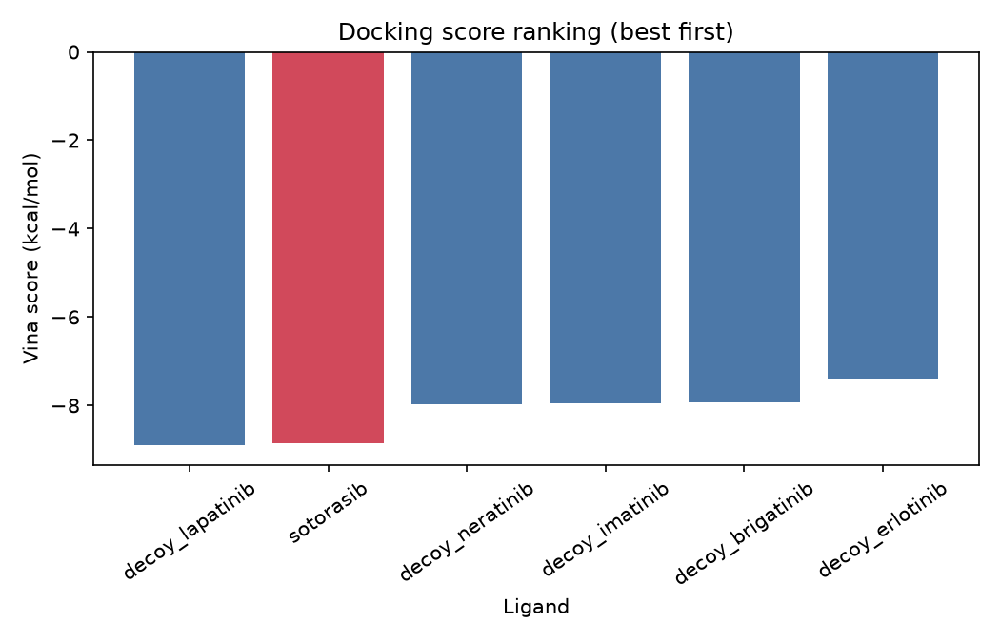

    # Group 5 - Drug docking: does Vina recover the KRAS G12C binder?

    **Research question:** Does AutoDock Vina rank sotorasib above five property-matched decoys when docked into the KRAS G12C switch-II pocket (PDB 6OIM)?

    **Data:** `data/ligands/*.pdbqt` - sotorasib and five decoy kinase inhibitors, already prepared with Meeko. `data/receptor.pdbqt` and `data/box.yaml` are produced once by the instructor with `prepare_receptor.py` (needs internet).

    Everything happens in **one file, `analysis.py`**. Each function is a stub that raises
    `NotImplementedError`. The file header says who implements what.

    | Owner | Functions |
    |---|---|
    | Student A | `dock_ligand`, `pose_rmsd` |
    | Student B | `dock_all`, `plot_ranking` |
    | **Both** (this is where the merge conflict happens) | `load_box`, `main`, `summary_sentence` |

    Shared parameters live in `config.yaml`. Both students must set the value marked
    `# BOTH` — you will disagree, and Git cannot decide for you.

    Run with `python analysis.py`. It must run without error after your merge.

**Before class (instructor):** `pip install -r requirements.txt && python prepare_receptor.py` downloads 6OIM
from the RCSB, writes `data/receptor.pdbqt`, `data/crystal_ligand.pdbqt` (sotorasib as bound) and fills `data/box.yaml`.
Docking six ligands at exhaustiveness 4 takes about a minute per ligand on a laptop.

    ## Results (fill in after the merge)

  AutoDock Vina did not rank sotorasib first among the six ligands: sotorasib ranked 2nd by Vina score, while its redocking RMSD was 0.28 Å.

    ## Reflection

    1. What caused each merge conflict?
    The merge conflicts were caused by both students modifying the same shared files and, in particular, the same functions in `analysis.py`. Student A and Student B worked independently on their branches, so Git could not automatically determine which version should be kept when both branches changed overlapping parts of the same file.
    
    A second conflict occurred in `results/summary.md` because both students created and modified the same file independently on `main`. When Student B tried to push after Student A had already pushed, Git rejected the push because the remote branch contained changes that were not present locally.

    2. How could branching strategy or file layout have avoided it?
    The conflicts could have been reduced by assigning different files or clearly separated sections of the code to each student. For example, Student A and Student B could have implemented their functionality in separate modules and then combined them through a shared main script.
    
    Another option would have been to avoid having both students modify the same shared functions independently. Clear ownership of each file or function would reduce overlapping changes and make automatic merging easier.

    3. What is the difference between the history produced by `git pull` and `git pull --rebase`?
    `git pull` fetches the remote changes and then merges them into the local branch. If both the local and remote branches have new commits, this can create an additional merge commit.
    
    `git pull --rebase` also fetches the remote changes, but instead of creating a merge commit, it temporarily removes the local commits, applies the remote changes first, and then reapplies the local commits on top of them. This produces a more linear history.
    
    In this exercise, Student B used `git pull --rebase` after the rejected push, which allowed the local Student B commit to be reapplied on top of Student A's remote commit after resolving the conflict.
